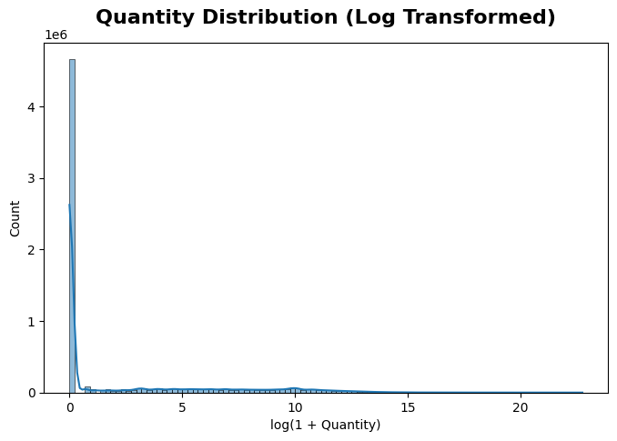
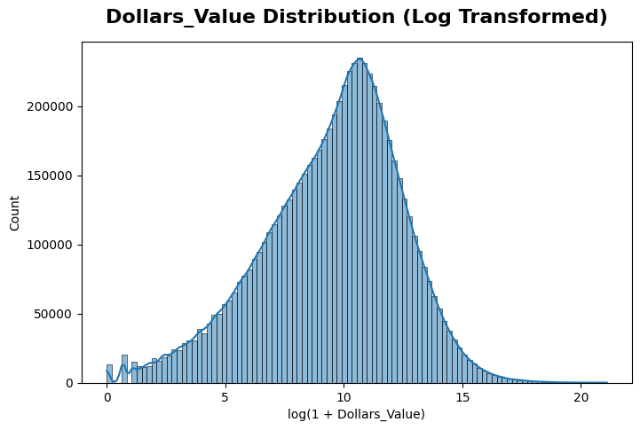
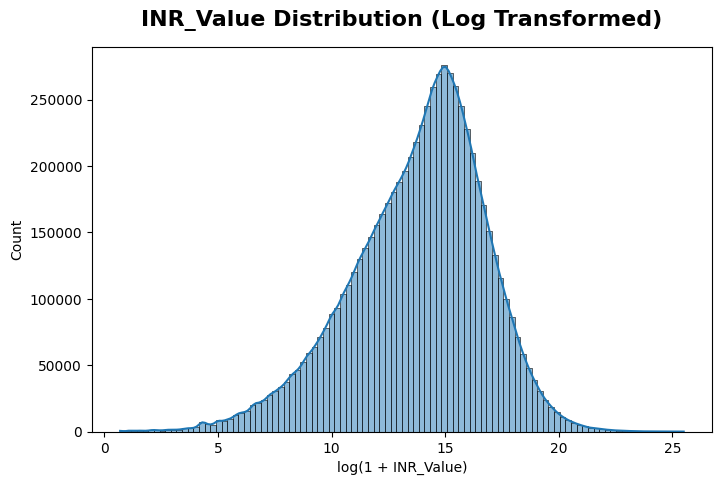
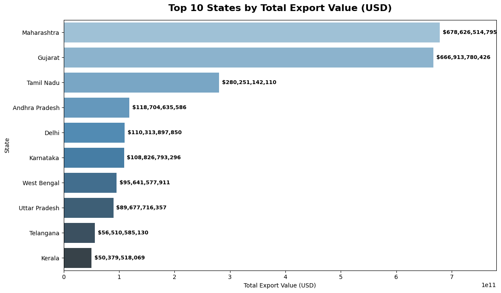
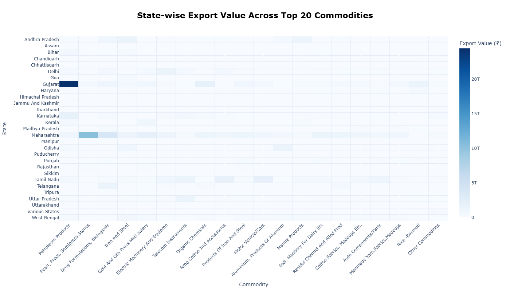
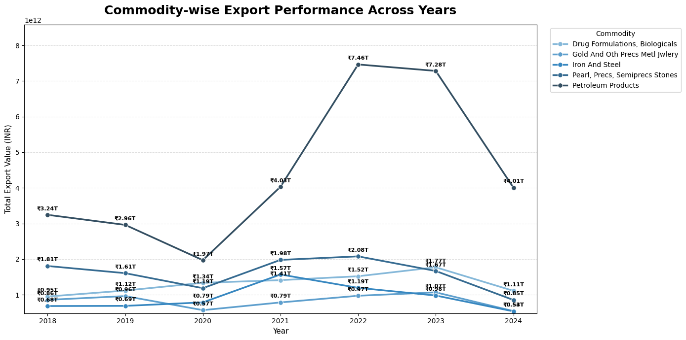

# India-Port-Level-Export-Analytics(2018-2024)
Data analysis of India’s port-level exports by principal commodity, covering export trends, commodity-wise performance, and key insights using Python.

## Project Overview

This project analyzes **India’s port-level export data from 2018 to 2024** at the principal commodity level.

The analysis focuses on understanding India's export performance across **years, states, ports, destination countries, and principal commodities**. Python-based data cleaning, statistical analysis, exploratory data analysis, and visualization techniques are used to identify important export trends, major contributors, and business insights.

The project transforms a large-scale export dataset into meaningful analytical findings that help understand **overall export performance, commodity-wise contribution, state-wise performance, yearly trends, and export concentration**.

## Business Problem

India’s export dataset contains a large number of records across **years, states, ports, destination countries, and principal commodities**. Analyzing this large volume of data manually makes it difficult to identify important export patterns and performance differences.

There is a need to systematically analyze the data to understand **overall export performance, major contributing commodities, state-wise export performance, yearly trends, commodity-state relationships, and export concentration**.

This project addresses the problem by applying **data cleaning, statistical analysis, exploratory data analysis, and data visualization using Python** to convert the raw export data into meaningful business insights.

## Project Objectives

1. **Analyze the overall export performance of India** across the available years based on export value and quantity.

2. **Identify the top-performing principal commodities** based on their contribution to total export value.

3. **Analyze state-wise export performance** and identify major exporting states.

4. **Examine yearly export trends** to understand changes in export performance over time.

5. **Analyze the relationship between commodities and states** to identify major commodity-state combinations.

6. **Identify commodity-wise changes across years** and understand how commodity performance varies over time.

7. **Measure the contribution and concentration of commodities and states** in total exports.

## Dataset Description

The dataset used for this project contains **India’s export data at the principal commodity level** for the period **2018–2024**.

| Attribute | Details |
|---|---|
| **Dataset Name** | Exports at Principal Commodity Level |
| **Source** | India Data Portal / Directorate General of Commercial Intelligence and Statistics (DGCI&S) |
| **Location** | India |
| **Domain** | Commerce / International Trade / Exports |
| **Time Period** | 2018–2024 |
| **Granularity** | State / Port / Principal Commodity |
| **Frequency** | Monthly |

### Dataset Features

The dataset contains export information across **states, ports, destination countries, and principal commodities**.

| Column | Description |
|---|---|
| `id` | Unique record identifier |
| `date` | Export date |
| `state_name` | Name of the exporting state |
| `state_code` | State code |
| `country` | Destination country |
| `port` | Export port |
| `pc_code` | Principal commodity code |
| `commodity` | Principal commodity name |
| `units` | Measurement unit |
| `quantity` | Export quantity |
| `dollars_value` | Export value in USD |
| `inr_value` | Export value in INR |

## Tools and Technologies Used

| Tool / Technology | Purpose |
|---|---|
| **Python** | Data analysis and exploratory data analysis |
| **Pandas** | Data manipulation, cleaning, and aggregation |
| **NumPy** | Numerical analysis and calculations |
| **Matplotlib** | Data visualization |
| **Seaborn** | Statistical and exploratory visualizations |
| **Plotly** | Interactive visualizations and heatmaps |
| **Google Colab** | Python development and analysis environment |
| **Git & GitHub** | Project version control and repository management |

## Data Analysis Workflow

The project follows a structured data analysis workflow to transform the raw export dataset into meaningful business insights.

**Data Collection**  
↓  
**Data Understanding**  
↓  
**Data Cleaning & Preprocessing**  
↓  
**Statistical Analysis**  
↓  
**Exploratory Data Analysis**  
↓  
**Data Visualization**  
↓  
**Key Findings & Business Insights**  
↓  
**Recommendations & Conclusion**

## Data Cleaning and Preprocessing

The raw dataset was cleaned and prepared to ensure data quality and consistency before performing statistical analysis and exploratory data analysis.

### Data Cleaning Steps

- **Duplicate Handling:** Checked the dataset for duplicate records and handled them appropriately.
- **Missing Value Analysis:** Identified missing values across all columns and analyzed their impact on the dataset.
- **Missing Units Treatment:** Missing values in the `units` column were associated with records having zero `quantity`. The missing unit values were therefore imputed using the mode, **Kgs**, while keeping the original quantity and export-value data unchanged.
- **Data Type Conversion:** Converted columns to appropriate data types, including:
  - `id` → String
  - `date` → Datetime
  - `state_code` → String
- **Column Cleaning:** Reviewed column names and retained the relevant variables required for analysis.
- **Outlier Analysis:** Examined extreme values in numerical variables such as `quantity`, `dollars_value`, and `inr_value`.
- **Feature Engineering:** Created additional time-based features:
  - `year`
  - `month`
  - `month_name`

### Final Dataset

After cleaning and preprocessing, the dataset was prepared for **statistical analysis, exploratory data analysis, and visualization**.

## Statistical Analysis

Statistical analysis was performed to understand the **central tendency, dispersion, and distribution** of the numerical variables in the dataset.

### Measures of Central Tendency

The following measures were calculated:

- **Mean**
- **Median**
- **Mode**

| Variable | Mean | Median | Mode |
|---|---:|---:|---:|
| `quantity` | 64,414.45 | 0.00 | 0.00 |
| `dollars_value` | 357,966.10 | 19,502.00 | $1.00 |
| `inr_value` | ₹27,242,250 | ₹1,466,100 | ₹82 |

### Measures of Dispersion

The following measures were calculated to understand the variability and spread of the numerical variables:

| Variable | Range | Variance | Standard Deviation |
|---|---:|---:|---:|
| `quantity` | 7,620,654,000 | 1.3841 × 10¹³ | 3,720,349 |
| `dollars_value` | $1,449,331,220 | 2.8155 × 10¹³ | 5,306,167 |
| `inr_value` | ₹119,263,437,035 | 1.659953 × 10¹⁷ | ₹407,425,200 |

The numerical variables showed **high variability and strong right-skewness**, indicating the presence of a relatively small number of records with very high export values and quantities.

### Distribution Analysis

Log transformation was applied to selected export-value variables to improve the visibility of their distributions and reduce the effect of extreme values.

> **Insight:** The original export-value distributions were highly right-skewed. The log transformation provided a more balanced distribution and made the underlying patterns easier to analyze.

## Exploratory Data Analysis

Exploratory Data Analysis (EDA) was performed to identify patterns, trends, relationships, and major contributors within India’s export data.

The analysis was structured around the project objectives and supported using appropriate **univariate, bivariate, and multivariate visualizations**.

### Objective 1: Overall Export Performance

Analyzed India’s overall export performance using **export value and quantity** across the available years.

**Visualizations Used:**
- Year-wise export performance
  
  

**Purpose:** To understand the overall scale and variation of India's exports.

---

### Objective 2: Top-Performing Principal Commodities

Identified the **top principal commodities** based on their contribution to total export value.

**Visualization Used:**
- Top commodities by export value
  

**Purpose:** To identify the major commodities contributing to India's exports.

---

### Objective 3: State-wise Export Performance

Analyzed export activity across Indian states to identify the **major exporting states**.

**Visualization Used:**
- State-wise export performance

**Purpose:** To compare export participation and performance across states.

---

### Objective 4: Yearly Export Trends

Examined changes in export performance across the **2018–2024** period.

**Visualization Used:**
- Year-wise export trend
  

**Purpose:** To identify periods of growth, decline, and changes in India's export performance.

---

### Objective 5: Commodity–State Relationship

Analyzed the relationship between **principal commodities and exporting states**.

**Visualization Used:**
- Commodity–state heatmap
  

**Purpose:** To identify major commodity-state combinations and regional export specialization.

---

### Objective 6: Commodity-wise Changes Across Years

Analyzed how the performance of major commodities changed across different years.

**Visualization Used:**
- Commodity-wise yearly trend
  

**Purpose:** To identify commodities showing growth, decline, or changing export patterns over time.

---

### Objective 7: Contribution and Concentration Analysis

Measured the contribution of major **commodities and states** to overall exports.

**Visualizations Used:**
- Commodity contribution analysis
  

- State contribution analysis
  

**Purpose:** To understand the concentration of India's exports among major commodities and states.

## Key Findings and Business Insights

* **Petroleum Products** was the largest export contributor, accounting for **16.23%** of total export value.

* The **Top 20 commodities contributed 62.12%** of total export value, indicating significant concentration among major commodities.

* **Maharashtra and Gujarat** were the leading states by total export value, followed by **Tamil Nadu**.

* Export value increased significantly from **2020 to 2022**, reaching the highest recorded value of **$453.26 billion in 2022**.

* Major commodities showed considerable year-to-year variation, with **Petroleum Products** consistently remaining a key export contributor.

* The **State–Commodity analysis** revealed different commodity strengths across states, indicating **regional specialization in exports**.

* The findings highlight the importance of monitoring major export contributors while exploring **commodity and market diversification opportunities**.

## Recommendations

* **Promote export diversification**
  Reduce dependence on a limited number of major commodities by encouraging a broader range of export products.

* **Strengthen high-performing commodities**
  Support sectors with strong and consistent export performance to sustain their contribution to India's exports.

* **Leverage state-level strengths**
  Encourage region-specific export development by improving infrastructure and supporting states with strong export potential.

* **Monitor yearly commodity trends**
  Regularly track commodity performance across years to identify emerging opportunities and declining export categories.

* **Expand into new markets and products**
  Explore new destination markets and product categories to improve export resilience and support long-term growth.

  ## Conclusion

The analysis provides a **data-driven overview of India's export performance from 2018 to 2024** across commodities, states, and years. The findings show that export value is significantly influenced by a limited number of major commodities and states, with **Petroleum Products** being the leading commodity contributor and **Maharashtra and Gujarat** among the leading exporting states.

Year-wise analysis also identified substantial changes in export performance, particularly between **2020 and 2022**. Overall, the project demonstrates how **Python-based data analytics** can transform large-scale export data into meaningful patterns, insights, and business recommendations.

## 12. Power BI Dashboard

The cleaned and analyzed export dataset was further developed into an interactive **Microsoft Power BI dashboard** to provide a consolidated view of India's export performance from **2018 to 2024**.

The dashboard brings together key performance indicators, year-wise export trends, top commodities, top exporting states, commodity-state analysis, commodity contribution, and destination-country analysis in a single interactive report.

### Dashboard

### 12.1 Dashboard Insights

The Power BI dashboard provides the following consolidated insights:

1. **KPI Insights:** The KPI cards provide a high-level summary of India's export performance and help users quickly understand the overall scale of exports.

2. **Year-wise Export Performance:** Export value varied considerably across the study period, with export performance reaching its highest level in **2022 at approximately $453.26 billion**.

3. **Top Commodities:** Export performance is strongly influenced by major commodities. **Petroleum Products** are the leading commodity contributor, followed by other high-value commodities such as Pearls, Drug Formulations, Iron & Steel, Gold, and Electric Machinery.

4. **Top Exporting States:** **Maharashtra and Gujarat** are among the leading exporting states, demonstrating their significant contribution to India's overall export activity.

5. **Commodity–State Analysis:** The commodity-state analysis highlights differences in export strengths across states and indicates **regional specialization** in particular commodities.

6. **Commodity Contribution:** The contribution analysis shows that a relatively small number of major commodities account for a substantial share of India's total exports, indicating a degree of **export concentration**.

7. **Destination Countries:** The destination-country analysis identifies the major international markets receiving Indian exports and provides an overview of India's export-market distribution.

8. **Interactive Analysis:** The year slicer and interactive visuals allow users to filter and compare export performance across different years, commodities, states, and destination markets.

### 12.2 Overall Business Insights

* India's export performance is significantly influenced by a limited number of major commodities and states.
* **Petroleum Products** are a major contributor to India's total export value.
* **Maharashtra and Gujarat** demonstrate strong export performance and play an important role in India's export ecosystem.
* Export value showed considerable variation during **2018–2024**, with **2022 recording the highest export value** in the analyzed period.
* Commodity-state analysis indicates that different states have different areas of export specialization.
* The concentration of export value among major commodities highlights the importance of **product diversification**.
* Analysis of destination countries provides opportunities for **market diversification and expansion**.
* The dashboard enables decision-makers to identify major contributors, monitor trends, and compare export performance interactively.

### 12.3 Dashboard Outcome

The Power BI dashboard converts the analytical findings from Python into an **interactive business intelligence report**. It provides a consolidated view of India's export performance and makes it easier to monitor trends, identify major commodities and exporting states, analyze regional specialization, understand export concentration, and evaluate destination markets.

Overall, the dashboard supports **data-driven decision-making** by transforming large-scale export data into clear and actionable business insights.

These KPIs provide an immediate overview of the scale and scope of India's exports.

# India Port-Level Export Analytics (2018–2024)

**Author:** Karunya Jayaraman  
**Project:** Data Analytics & Business Intelligence Capstone Project  
**Technologies:** Python | Pandas | NumPy | Matplotlib | Seaborn | Plotly | Excel | Power BI | GitHub
